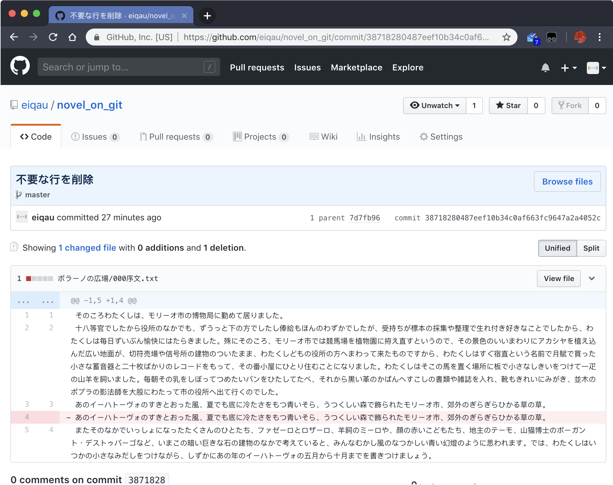
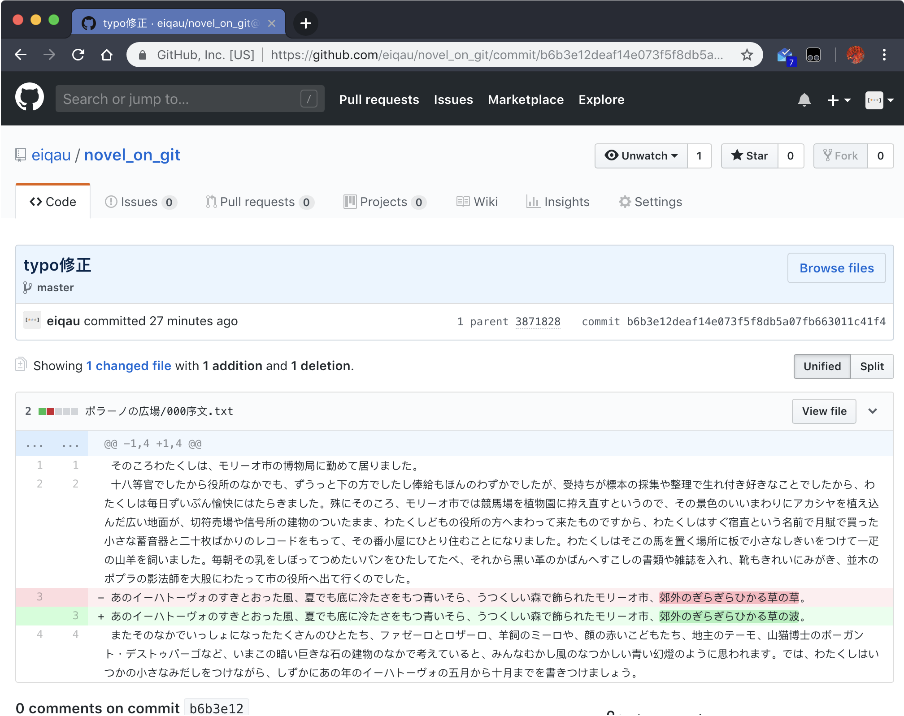

# Gitで小説のバージョン管理をする
## Gitとは？
本体はサーバーに置いておいて、**本体をコピー**したものをPCやスマートフォンなど (以下、「ローカル」) で編集する

ローカルで作業している内容が最新の情報で、サーバーに置かれている本体は作業が進めば進むほど古い情報になっていくので、サーバーの情報を更新するために、編集作業が終わったり、ある程度の区切りがついた時点で、**ローカルの作業内容をサーバー側にも適用する**という一手間を加える。

これによって、
- ある日突然、PC上で作業中のファイルがぶっ壊れても、サーバーの本体は生きているので、ある程度 (最後にサーバーに適用したところまで) ダメージを抑えることができる
- 出先でいい感じの表現を思いついたときに、ノートPCやタブレットやスマートフォンにサーバーのデータをコピーして作業したりできる。作業内容をサーバーに適用しておけば、自宅のPCで**サーバー側の更新を引っ張ってくる**ことで、いい感じの表現が適用されたデータで継続して作業できる

などのメリットが得られる

この一連の機能を提供するシステムが、Gitである

### クローンとかプッシュとかよくわからん、コミットってムキムキになるやつ？
Gitで使われる言葉には、プログラマではない人にとってちょっと引いちゃう感じの漠然としたハードルがあるので、すとんと飲み込むのに抵抗があると思うのだが、前の項 (の太字のところ) でだいたい説明済みの内容である。
- **クローン**は、サーバーにある本体をローカルにコピーする行為である
- **コミット**は、ローカルでの作業内容を確定する行為である
- **プッシュ**は、コミットした作業内容をサーバーに送信して、サーバーの情報を更新する行為である
- **プル**は、サーバーの情報がローカルよりも新しいとき (出先でスマホで編集したときなど) に、サーバーの情報をローカルに引っ張ってくる行為である

「ブランチ」とか「プルリクエスト」(文語ではPR、口語ではプルリクと略されることが多い) とかは、まだ気にしなくてOK

### ほーん、で？
ここまでに記載した内容であれば、オンラインストレージにファイルを置いておくだけでいいんじゃないの？と思われるのではないだろうか。確かにそのとおりである。

たとえばBoxにはバージョン管理機能があって、同名ファイルを保存するとv2, v3とバージョンがアップデートされていき、さかのぼって過去のバージョンを確認することができる。

しかし小欄はGitを紹介するテキストなのでBoxの宣伝で終わるわけにはいかない。小説家にとって、 (あるいは後述するが校閲などにとって、) Gitの強みが、**差分管理**である。

## 差分管理

すでに何度かのコミット・プッシュを行った**プロジェクト**と**リポジトリ**を用意した。ここにきて初出の言葉だが、プロジェクト、リポジトリとは何かを説明するのは非常に難しい。この説明はあとにまわそうと思う。

「typo修正」とか、「不要な行を削除」とか書いてある1つ1つが、**コミット**である。一番下が古く、上に行くほど最新の情報である。

「typo修正」などのテキストはその作業内容が何をしたものなのか、簡単に説明する文章である。後述するがGitは**複数人で利用する**こともできるので、自分もそうだが他の人にもわかりやすいように、適切な説明文を書こう。天元突破しそうなふざけたコメントを付けるのは、あんまり好ましくない。

横道に逸れまくったが、「差分管理」とはなにか、見てみよう。
### 過去の編集における変更差分をチェックする

上の図は、「ポラーノの広場」というフォルダの中に、「000序文.txt」というファイルを作った、という作業のコミットである。変更 (ここでは新規作成だが) を行ったファイルが一覧に (1つしかないので一覧も何もないが) 表示され、作業内容がプレビューされる。

次のコミットで、「序文加筆」している。追加された行はプラス記号がついて緑色にハイライトされていて、1行目はそのままに、2行目移行が加筆されていることがわかる。

次の「不要な行を削除」のコミットでは、コピペしすぎて2重になってしまっている行を削除している。削除された行はマイナス記号がついて、赤色にハイライトされている。

また、左側に行番号の表示があるが、2つ並んだ左側が、このコミットによる変更の前は何行目だったかを示す数値で、右側が変更後の数値である。いままで4行目だった行が削除されて、5行目だったところが4行目になっていることがわかる。

最後の「typo修正」では、このまま公開すると笑いものになってしまいそうな打ち間違いを修正している。Gitはあくまで行単位で変更を管理するので、「これまでの3行目が削除」されて、「新しい3行目が追加」されたという扱いになる。いまは4行しかないテキストだが、10行、100行、1000行と加筆されていくと、この色によるハイライトが効いてくる。

### 現在編集中の内容が、どんな変更をもたらすのかチェックする
WIP

## 複数端末 (PCとスマホなど) でGitを使う
WIP

## 複数人でGitを使う
WIP

## GUIクライアントを使う
硬派なプログラマは黒い背景に白文字が出てくる怖い画面でカチャカチャやってGitを使いこなしたりするが、ハードルが高すぎるのでもっと便利なツールを使おう。

白文字をカチャカチャやるタイプのインターフェースをCUIまたはCLI (キャラクター・ユーザー・インターフェースまたはコマンド・ライン・インターフェース) というが、GUI (グラフィカル・ユーザー・インターフェース) というのは、もっと人間にやさしいインターフェースのことである。

#### GUIの例
- 「受話器が上を向いているアイコンのあるボタン」が、電話を発信・受話する機能を呼び出すことを示している
- 何かを削除するときに、赤や黄色の警告マークが表示される
- 何かを選択しているとき、選択中のアイテムにチェックマークがついたり色でハイライトされたりする

// TODO: WindowsでCtrl+ドラッグでコピーしようとしている画像と、copyコマンドを打とうとしている画像を置く
